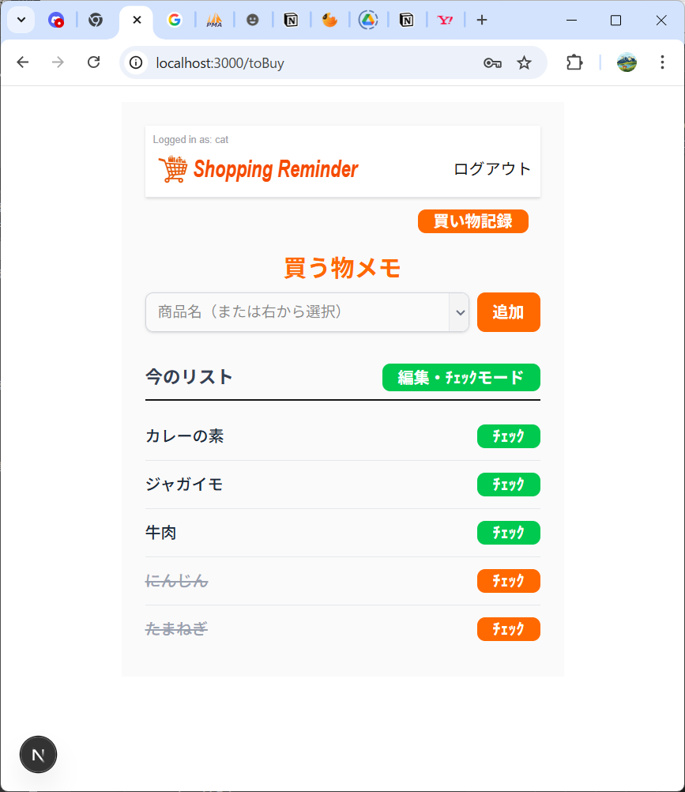
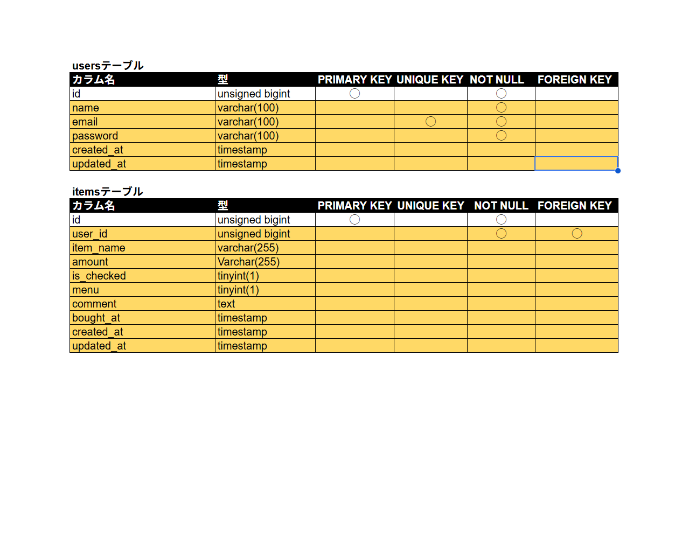
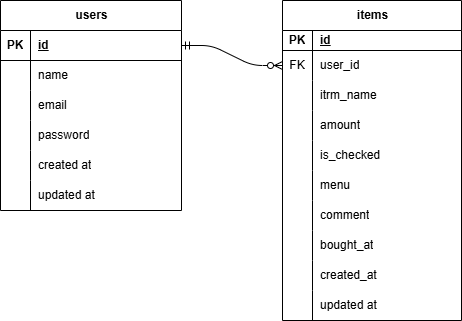

# README

# README.md

# Shopping-Reminder

## プロジェクト名: shopping-reminder

## １)概要説明

ポートフォリオの作成をテーマに簡単なアプリの製作に取り組みました。
日常の食品や生活用品の買い物で、買い忘れが多いので、これを簡単なアプリで防げないかと思い、アプリを作ってみました。

① スマホ利用を想定してコンパクトな２画面にまとめました。

②日常の買い物を想定した作りとなっていますが、ToDoアプリとしても利用可能です。

### 【機能概要】

品名を入力して買い物リストを作成し、買い終わると消込ができます。消し込んだ品名はデータベースに保存され、記録を確認することができます。補助機能としてプルダウン入力機能、入力メニュー選択機能、品名編集機能などを付加して操作性向上を実現しました。特に、編集機能はインライン機能とし、画面遷移することなくその場で修正でき、品名だけでなく、数量、店名などのメモを追記することも可能です。

**操作方法**

①ユーザー登録、ログインは通常の操作になっています。

② 品名入力はキー入力とプルダウンメニューが選択できます。
　　・買い物記録画面のリストが選択メニューが表示されるようになっています。

③ 入力した品名はリストに表示され、チェックボタンで消し込み表示されます。

④ 品名をクリックすると品名の編集ができ、Enterキーで確定します。

⑤ デフォルトの編集・ﾁｪｯｸモードをクリックすると消去モードに変わり各項目が消去できます。
　消去モードボタンクリックで編集・ﾁｪｯｸモードに戻ります。

⑥ 買い物記録ボタンで過去の買い物の履歴が表示されます。

　　・買い物記録画面のメニュー表示オン／オフの選択ボタン※で、品名入力の選択メニュー
　　　に必要な品名だけを表示できます。
　　　※重複名がある場合には先頭の行にだけボタンが表示されます




## ２)作成した目的

以前からポートフォリオ作成の課題がありましたので、今回作成することとしました。第一歩として簡単な今回のアプリを作成してみましたので、評価と今後に向けてのアドバイスなどを頂けたらと考えております。

## ３)アプリケーションＵＲＬ

**GitHubリポジトリURL : github.com:oxnut134/shopping-reminder**

```jsx
**markdown**
### Clone with SSH
```bash
git clone git@github.com:oxnut134/shopping-reminder
```

## ４）機能一覧

```jsx
ユーザー登録
ログイン・ログアウト
買う物入力・取得・一覧表示・編集・削除
買い物記録取得・一覧表示・入力メニュー登録指定
```

## ５）使用技術

### フロントエンド

- **Next.js** 16.1.6（Turbopack）
- **React** 19.2.3
- **React-Hook-Form** 7.79.1
- **Axios** 1.7.9

### バックエンド

- **Laravel** 8.3.24
- **PHP** 8.3.24
- **Nginx** 1.27.5
- **MySQL** 9.0.1
- **Docker** 29.1.5

### ユーザー認証

- **Laravel Breez** v2.3.8

## ６)テーブル設計



## ７)ＥＲ図



## ８）環境構築

## ８－１)基本構成

今回のプロジェクトはフロントエンドをNext.js、バックエンドをLaravelで構築しました。また、プロジェクトディレクトリはshopping-reminderとして、その直下にfrontendディレクトリとbackendディレクトリを配置し、ローカルリポジトリはshopping-reminderディレクトリに設定しました。

### ディレクトリ構成

```
shopping-reminder/
├── backend/        # Laravel (API)
├── frontend/       # Next.js (UI)
├── README.md       # README
├── shopping-reminder.drawio  # ER図（編集用）
└── shopping-reminder.png     # ER図（イメージデータ）
```

### プロジェクトclone作成

```jsx
       git clone git@github.com:oxnut134/shopping-reminder
```

## ８－２）フロントエンドの立ち上げ

### Next.js

**ライブラリのインストール**

```jsx
　　　　cd frontend
　　　　npm install
　　　　　※node_modulesフォルダが作成される。
```

**環境設定ファイルの作成**

```jsx
　　copy null > .env.local (cmd)
　　New-Item .env.local -ItemType File (PowerShell)

　　.env.localにNEXT_PUBLIC_BACKEND_URLを記述
```

**Next.js起動こで**

```jsx
　　　**bash**
　　　npm run dev
```

## ８－３）バックエンドの立ち上げ

### [ laravel ]

本プロジェクトでは Docker を使用して PHP(Nginx) および MySQL 環境を構築しています。

**./backend/env作成**

```jsx
cd backend
copy null > .env (cmd)
New-Item .env -ItemType File (PowerShell)

※.env編集
GID=1000
UID=1000
DB_CONNECTION=mysql
DB_HOST=db
DB_PORT=3306
DB_DATABASE=[your DB name]
DB_USERNAME=[your DB user name]
DB_PASSWORD=[your password]

```

**./backend/src/env作成**

```jsx
cd src
copy .env.sample .env (cmd)
Copy-Item .env.example .env (PowerShell)

※.env編集
DB_CONNECTION=mysql
DB_HOST=db
DB_PORT=3306
DB_DATABASE=[your DB name]
DB_USERNAME=[your DB user name]
DB_PASSWORD=[your password]
```

**Docker立上げとパッケージインストール**

```jsx
cd backend
docker compose build
docker compose up -d
docker compose exec app composer install
```

 **APP_KEY作成**
   `docker compose exec app php artisan key:generate`

### [ database ]

**MySQLコンテナログイン**

```bash
　　docker compose exec db bash
```

**MySQL起動**

```css
　　mysql -u [your DB name] -p
```

※パスワード入力

**Database確認**

```
　　show databases;
```

### ・migration

```jsx
  bash
  php artisan migrate
```

### ・Seeding

```jsx
　bash
  php artisan db:seed
  ※サンプルデータが生成されます。　　
```

## ９）追記

今回は、題材として買い物をイメージし、買い忘れを防ぐ目的で作成しましたが、製作中に、買い物に限らず日常生活、仕事、趣味などのもろもろに関しても、リマインダーとして使えることに気が付きました。品名をタスクに変えれば汎用のリマインダーにもなりそうです。いったん今の形でまとめておき、まずは使ってみて、今後汎用のタスクリマインダーにするか、さらに買い物に特化する方向にするかを探ってみたいと思っています。